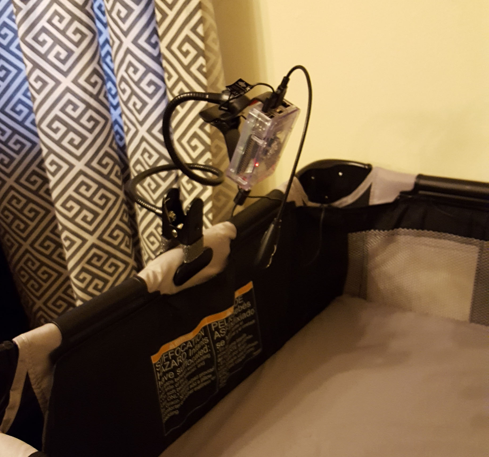

Title: Building a Raspberry Pi 3 Baby Monitor
Lead: Use a Raspberry Pi and a couple cheap components to create an HD livestream that you can view on any device within your home.
ShowInNavbar: false
Comments: true
GitHubSource: https://github.com/kamranayub/kamranayub.github.io/blob/source/input/guides/raspberry-pi-3-baby-monitor.md
---

After looking at reviews for baby monitors, a few things were clear:

1. Manufacturers aren't putting good cameras in these monitors
2. Some have night vision, some don't and the quality usually sucks.
3. If the monitor can be viewed remotely, it sometimes runs insecure RF wireless and [can be snooped on or intercepted](https://arstechnica.com/security/2015/09/9-baby-monitors-wide-open-to-hacks-that-expose-users-most-private-moments/)
4. Good monitors aren't actually baby monitors, they're just nice cameras (Nest Cam) and cost $200+

I knew there had to be a better, more affordable way to keep tabs on our little guy. A [Raspberry Pi](http://raspberrypi.org) was a perfect solution--it has a camera module with 1080p resolution, it has USB ports for extra peripherals, it's portable, and it's cheap.

Check out the resulting image quality:

**720p, low light**


**720p, high light**


It's possible to reach 1080p with the Pi camera, it's up to you--I found 720p to be perfectly acceptable but 1080p caused the image to "zoom in" a bit too much. If I figure that out, I'll update the guide accordingly.

This guide will show you how to build your own DIY baby monitor using a Raspberry Pi 3. The image and sound will be way better than any low- to mid-level monitors (and cheaper!). Additionally, this will give you a lot of flexibility to add other functionality such as a speaker, etc. Since the Raspberry Pi is under your control, you can choose to expose it only within your home network or securely over the Internet--no weird Internet of Things or cloud "phone home" nonsense or possible vulnerabilities that allow people to view your baby. It will be as secure as your home network and if you choose to expose it publically, you can use encryption and strong passwords to secure it (this guide does not cover that).

## In This Guide

- [Updates](#updates)
- [The Hardware](#the-hardware)
- [Who This Guide is For](#who-this-guide-is-for)
- [Nightvision Support](#nightvision-support)
- [Programmable LED Light](#programmable-led-light)
- How To
    - [Installing the Pi Camera](#installing-the-pi-camera)
    - [Configuring the Pi](#configuring-the-pi)
    - [Configuring Raspbian](#configuring-raspbian)
    - [Installing Picam](#installing-picam)
    - [Running Picam at Startup](#running-picam-at-startup)
    - [Installing nginx](#installing-nginx)
    - [Mounting the Monitor](#mounting-the-monitor)
    - [Viewing on a Device](#viewing-on-a-device)
    - [(Optionally) Adding a Web Player](#optionally-adding-a-web-player)
    - [(Optionally) Exposing over the Internet](#optionally-exposing-over-the-internet)

## Updates

### 2019-06-08

- Updated binary section to reflect instructions for Rasbian Buster

### 2018-01-11

- Fixed picam extraction command typo because the archive contains the original filename as the top-level folder

### 2017-10-25

- Thanks to [Andrew](#comment-3574356701) for pointing out some differences between different Raspbian versions! I updated the Picam installation step.
- I updated my Picam arguments to be what I'm using now after some testing. The args I'm using seem pretty stable now.

### 2017-10-02

- I missed the fact that the `/run/shm` directories are blown away on Pi restarts. The startup script now makes sure they exist (should fix slow feeds).
- I updated my picam-viewer web player to use Video.js now which should support more devices.
- It's been reported in the comments that the Pi Zero works well for this!

## The Hardware

Here's what you'll need, it's what I have and it works great:

- [Raspberry Pi 3 Canakit](https://www.amazon.com/gp/product/B01C6EQNNK/ref=as_li_tl?ie=UTF8&camp=1789&creative=9325&creativeASIN=B01C6EQNNK&linkCode=as2&tag=kamranicus-20&linkId=cefba209294d3cf51f3be3d51bd18990) - $50
  - **OR** [Raspberry Pi Zero W Canakit](https://www.amazon.com/gp/product/B071L2ZQZX/ref=as_li_tl?ie=UTF8&camp=1789&creative=9325&creativeASIN=B071L2ZQZX&linkCode=as2&tag=kamranicus-20&linkId=11a90708c6058c931d343f5a34243809) - $25
- [Raspberry Pi Camera Module v2](https://www.amazon.com/gp/product/B01ER2SKFS/ref=as_li_tl?ie=UTF8&tag=kamranicus-20&camp=1789&creative=9325&linkCode=as2&creativeASIN=B01ER2SKFS&linkId=c4b2ac954d25538e792e193ff088faac) - $30
- [MicroSD card](https://www.amazon.com/gp/product/B010Q57T02/ref=as_li_tl?ie=UTF8&tag=kamranicus-20&camp=1789&creative=9325&linkCode=as2&creativeASIN=B010Q57T02&linkId=6ad18aebc7e3dd06daf87ef2f40910a4) (8GB or higher) - $12
- [Kinobo Mini Akiro USB condenser microphone](https://www.amazon.com/gp/product/B00NSOWWIS/ref=as_li_tl?ie=UTF8&tag=kamranicus-20&camp=1789&creative=9325&linkCode=as2&creativeASIN=B00NSOWWIS&linkId=b66c7df0a0cac98747907f0815de7727) - $15
  - Or, less flexible but smaller [Kinobo Makio USB microphone](https://www.amazon.com/gp/product/B00IR8R7WQ/ref=as_li_tl?ie=UTF8&tag=kamranicus-20&camp=1789&creative=9325&linkCode=as2&creativeASIN=B00IR8R7WQ&linkId=177490daf1de57639c4d8a8c1793276d) - $3
- [i2 Gear USB LED lamp](https://www.amazon.com/gp/product/B00D2ZDY2Q/ref=as_li_tl?ie=UTF8&tag=kamranicus-20&camp=1789&creative=9325&linkCode=as2&creativeASIN=B00D2ZDY2Q&linkId=b5274841a23c61599f27a6b31c4111ca) (optional) - $5
- [BESTEK phone mount](https://www.amazon.com/gp/product/B0126JQ9G6/ref=as_li_tl?ie=UTF8&tag=kamranicus-20&camp=1789&creative=9325&linkCode=as2&creativeASIN=B0126JQ9G6&linkId=9523b6886ba2aac0800fc3bacc4f9705) (optional) - $11
- HDMI cable (temporary)
- USB keyboard/mouse (temporary)
- Laptop to configure the Pi

You can snag all the hardware needed for ~$100 off Amazon. I went with a 32GB SD card but that's just me, you could configure this to store all videos/photos on a network device or cloud account.

The gooseneck LED light is optional--I want to be able to have the monitor have a night-light attached vs. having to have a separate ambient light at night.

For mounting the Pi, it's up to you. I need to mount it to the bassinet/crib and a clamp-based gooseneck mount is perfect for me (at least until the little guy starts moving around and grabbing things!). You may want to wall-mount it, use cardboard, etc. Use whatever works for you!

## Who This Guide is For

I am a developer by trade but I will try to keep this guide as simple as possible. You presumably are ready to get your hands (a little) dirty if you have a Pi but if you're like me, Linux is not your forte. With that in mind I've tried not to assume you know anything about Linux.

The other nice thing about using a Raspberry Pi is that it's easy-to-use! There are a lot of guides and tutorials available for the device.

## Nightvision Support

Originally I had planned to use the Pi NoIR camera module because it can see infrared light. However, since infrared light is still light (just not visible) I didn't really want to take a chance of accidentally "shining" it straight onto my son's face. [There is no real evidence](http://www.intersil.com/content/dam/Intersil/documents/an17/an1737.pdf) to suggest that infrared baby monitors are dangerous to infants--but concentrated IR is still not good to have directed at you. The fact is that nightvision baby monitors probably use a very low light level and it's *probably* not dangerous at all.

If you want to add nightvision to this monitor, simply replace the normal camera module above with the [Pi NoIR Camera module](https://www.amazon.com/gp/product/B01ER2SMHY/ref=as_li_tl?ie=UTF8&tag=kamranicus-20&camp=1789&creative=9325&linkCode=as2&creativeASIN=B01ER2SMHY&linkId=0f96de503803ea64bfb9b0f854cc9fe0). You will then need to find a suitable infrared light to use at night.

I have opted to use a simple flexible USB light that I can shine specifically where it makes sense and won't be in the baby's line of sight. It has an on/off switch which comes in handy for my wife at night to simply lean over and switch on too.

## Programmable LED Light

While I opted for a simple on/off nightlight, you could potentially go crazy with a [BlinkStick Nano USB light](https://www.blinkstick.com/products/blinkstick-nano#mini-shop) that is programmable, so you could have it automatically turn on in low-light conditions, program light shows, or what have you.

## Installing the Pi Camera

To install the camera on the Pi, firmly insert the end of the cable with the silver pins facing *toward* the HDMI port.

The reason I picked the Canakit was because the case allows you to just attach the camera on the inside, allowing an integrated camera.


## Configuring the Pi

First things first, we need to configure our Raspberry Pi. The [software installation guide](https://www.raspberrypi.org/learning/software-guide/quickstart/) on the Raspberry Pi site is perfect and easy to understand.

Follow all the steps until your SD card has NOOBs or Raspbian extracted to it. I used the NOOBS offline (1GB) image.

Connect the Pi via HDMI to a monitor or TV. Connect a mouse/keyboard to the Pi for configuring. Connect an Ethernet cable unless you want to use Wi-Fi during the guide.

Boot up your Pi (i.e. plug it in), you should see a screen showing different options of Operating Systems to install. Select Raspbian, connect to Wi-Fi (or use a Ethernet cable) and begin the installation. Wait for it to complete and then proceed.

## Configuring Raspbian

> **Advanced Users**: You can SSH into the Pi without using the user interface, you just need to know the IP address (check your router). You also need to use the raw Raspbian image, you can't SSH using the NOOBS installer.

I'm sorry I have to delve into the command-line but because Raspberry Pi is a Linux device, most of the power user features are only available through there. Hey, presumably you're reading this because you want a power user baby monitor! We have to get our hands a little dirty.

Launch the Terminal app on the Pi (it's in the menu bar at the top).

Run the following command:

    sudo apt-get update && sudo apt-get -y dist-upgrade

When the prompt changes to a changelog, press `Ctrl-C` to close the wall of text, then `Enter` to continue.

This takes awhile! This updates Raspbian to the latest updates including security patches. You want to run this every so often to keep the operating system up-to-date. There are more technical guides on [automatic updating](https://wiki.debian.org/UnattendedUpgrades) so you don't need to login to keep it up-to-date.

### Configure Pi Settings

Time to configure the Raspberry Pi!

In the terminal, type

    sudo raspi-config

1. Select Change User Password and **use something more secure**. This is the main password for your device.
2. Under option 5, enable the camera
3. Under Internationalization Options, change your Timezone
4. Under Advanced Options, enable SSH so you can connect to the Pi remotely (or don't! If you want to always configure it using keyboard/mouse/monitor)
5. Under Advanced Options, you can change the hostname (recommended). I used `babypi`

### Configure Hostname

The Raspberry Pi can be pinged and connected to via the hostname `babypi.local` or whatever name you chose in the last step (plus `.local` at the end). However, the IP address this defaults to is a long one (IPv6). Web browsers can have trouble connecting to the Pi with this enabled, so we need to disable IPv6 hostname resolution.

    sudo nano /etc/avahi/avahi-daemon.conf

On the line `use-ipv6=yes` change `yes` to `no`. Press `Ctrl-O` to save (hit Enter), then `Ctrl-X` to exit.

Now reboot! `sudo reboot`

You should be able to ping your Pi from another machine:

    ping babypi.local
    ping -4 babypi.local
    
The second command forces the ping to return the IPv4 address. On Windows you may need the [Bonjour service installed](https://support.apple.com/kb/DL999?locale=en_US) if you don't have iTunes installed.

Some devices (my Android phone for example) still won't be able to use `babypi.local` so you'll still need the IP address of your Pi, which you can see with `ip addr show`.

> **Note:** I had some issues on Windows trying to access http://babypi.local in my browser. When I pinged my Pi, I got a private address space back (198.105.x.x) instead of the local IP. I changed my router's DNS to Google's public DNS servers and *for some reason* that worked. I think CenturyLink (my ISP) was somehow interfering since it would always redirect to some proprietary search results page. However, with the knowledge I have of networking and DNS, this still makes no sense to me! 

### Configure Wi-Fi

If you plan to have your baby Pi be wireless, you will need to connect it to your Wi-Fi network. To do so, just follow this guide: https://www.raspberrypi.org/documentation/configuration/wireless/wireless-cli.md

## Installing Picam

Because we want to stream *both* audio and video from the camera and USB microphone, we need to use a software project called [Picam](https://github.com/iizukanao/picam).

Make sure to run *all commands* from the Pi user directory, i.e. your prompt should look like:

    pi@raspberrypi:~ $

The `~` denotes your user's home directory.

Run the following command in the terminal to install some Picam dependencies:

    sudo apt-get install libharfbuzz0b libfontconfig1
    
Then this entire thing (if you are using SSH, just copy/paste otherwise have fun!):

    cat > make_dirs.sh <<'EOF'
    DEST_DIR=~/picam
    SHM_DIR=/run/shm
    mkdir -p $SHM_DIR/rec
    mkdir -p $SHM_DIR/hooks
    mkdir -p $SHM_DIR/state
    mkdir -p $DEST_DIR/archive
    ln -sfn $DEST_DIR/archive $SHM_DIR/rec/archive
    ln -sfn $SHM_DIR/rec $DEST_DIR/rec
    ln -sfn $SHM_DIR/hooks $DEST_DIR/hooks
    ln -sfn $SHM_DIR/state $DEST_DIR/state
    EOF

Then the following, to execute the script we just made and create the required directories:

    chmod +x make_dirs.sh
    ./make_dirs.sh

Now here is important! **If you are using Jessie or Stetch on your Pi, you need the right binary file**! Thanks to [Andrew](#comment-3574356701) for pointing this out in the comments.

- For Jessie: https://github.com/iizukanao/picam/releases/download/v1.4.6/picam-1.4.6-binary-jessie.tar.xz
- For Stretch: https://github.com/iizukanao/picam/releases/download/v1.4.6/picam-1.4.6-binary-stretch.tar.xz

If you are using Buster, you can follow the instructions verbatim from the [install guide for picam](https://github.com/iizukanao/picam/#installation) and use the latest binary (1.4.7 as of 8 July 2019).

Now we install Picam directly using the link above:

    wget <URL ABOVE> -O picam-1.4.6.tar.xz
    tar xvf picam-1.4.6.tar.xz
    cp picam-1.4.6-binary-<DIST ABOVE (jessie/stretch)>.tar.xz/picam ~/picam/

We now have Picam installed! It's time to get a stream working.

To configure Picam to use our microphone, we need to know what its "device ID" is. Run the following to list any USB recording devices:

    arecord -l
    
The name will be Card # and Device #, so for example, here is mine:

    **** List of CAPTURE Hardware Devices ****
    card 1: Device [USB Audio Device], device 0: USB Audio [USB Audio]
      Subdevices: 1/1
      Subdevice #0: subdevice #0

You see "card 1" and "device 0" so my microphone ID will be `hw:1,0`.

Now, let's make a script we can run to start Picam. **Replace "hw:1,0" with your device ID above if it's different.**:

    echo -e "sudo bash /home/pi/make_dirs.sh\nsudo /home/pi/picam/picam -o /run/shm/hls --time --alsadev hw:1,0 > /var/log/picam.log 2&>1" > run_picam.sh
    chmod +x run_picam.sh

This creates a `run_picam.sh` script in our root (`~`) directory and marks it as executable. The script starts Picam with a HLS stream output to the RAM drive (fast) and uses our microphone as the recording device. It also writes out the current timestamp in the bottom corner of the stream. There are a [ton of other options](https://github.com/iizukanao/picam) too including subtitles, etc. The default video resolution is 720p which is fine enough for a babycam.

The script also writes the Picam output to `/var/log/picam.log` for debugging purposes.

To edit this script anytime after creating, just use:

    nano run_picam.sh
    
The nano editor is very straightforward to use. Ctrl-O to save, Ctrl-X to exit.

Test the script by typing `./run_picam.sh`, you should see:

    pi@babypi:~ $ ./run_picam.sh
    created state dir: ./state
    created hooks dir: ./hooks
    created directory: ./rec
    created directory: ./rec/tmp
    created directory: ./rec/archive
    created HLS output directory: /run/shm/hls
    configuring devices
    capturing started

Just press Ctrl-C to exit.

For reference, this is my full `run_picam.sh` script for my Pi:

```bash
sudo bash /home/pi/make_dirs.sh
sudo /home/pi/picam/picam -o /run/shm/hls --samplerate 32000 --channels 2 --audiobitrate 96000 --videobitrate 4000000 --vfr --avclevel 3.1 --autoex --time --alsadev hw:1,0  >/var/log/picam.log 2>&1
```

## Running Picam at startup

[There's a great post](http://www.stuffaboutcode.com/2012/06/raspberry-pi-run-program-at-start-up.html) on how to run a script at startup. We want Picam to run right away when the Pi boots up, so let's do that!

Create the script:

    sudo nano /etc/init.d/picam
    
Then copy/paste the following:

    #! /bin/sh
    # /etc/init.d/picam
    
    ### BEGIN INIT INFO
    # Provides:          picam
    # Required-Start:    $remote_fs $syslog $network
    # Required-Stop:     $remote_fs $syslog $network
    # Default-Start:     2 3 4 5
    # Default-Stop:      0 1 6
    # Short-Description: Simple script to start Picam at boot
    # Description:       A simple script to start Picam at boot
    ### END INIT INFO
    
    # If you want a command to always run, put it here
    
    # Carry out specific functions when asked to by the system
    case "$1" in
      start)
        echo "Starting Picam"
        # run application you want to start
        sudo /home/pi/run_picam.sh
        ;;
      stop)
        echo "Stopping Picam"
        # kill application you want to stop
        killall picam
        ;;
      *)
        echo "Usage: /etc/init.d/picam {start|stop}"
        exit 1
        ;;
    esac
    
    exit 0


This is an initialization script that will execute our `run_picam.sh` script we just made. 

Mark it as executable:

    sudo chmod +x /etc/init.d/picam

Now, let's test it.

    sudo /etc/init.d/picam start
    
You should see the Picam output. Picam is now running in the background! You can stop it manually like this:

    sudo /etc/init.d/picam stop

Now let's register it on startup:

    sudo update-rc.d picam defaults

All set. We can test it out by rebooting the Pi and verifying the Picam process is running.

    sudo reboot
    
Once the Pi is booted, type `top` to see running processes. You should see Picam at the top.


## Installing nginx

We've set up Picam to output a stream to a file but we need to expose that stream so we can connect to it from our devices or web browsers. "nginx" is a web server that can do that for us.

Let's install nginx:

    sudo apt-get install nginx

Now let's expose the RAM stream as a directory:

    sudo nano /etc/nginx/sites-available/default
    
In the editor, scroll down to right before `location / {` and add a new block above it:

    location /hls/ {
        root /run/shm;
    }

This adds a new /hls URL that points to the /run/shm/hls directory Picam is outputting the stream to.

Ensure nginx is started (it will start automatically):

    sudo /etc/init.d/nginx start
    
This starts the web server. Now you can browse (on the Pi or other device) to the root of the site and view the nginx welcome page.

For example, type in `http://<ip address>/` to see the default homepage. 

## Mounting the monitor

Now that we've configured the baby Pi, we need to put it near the baby! As I mentioned at the start, I am just using a simple LED light to help when its dark. With a gooseneck mount, we can also position the monitor in whatever way we need that provides the best view of the crib. What's nice is that you can fit everything you need onto a single Pi, so it can travel with you.




It looks a bit like an angler fish but it does the job!

## Viewing on a device

We're officially all set up! That's all that is needed to use our baby monitor.

In the first part where you configured the Pi, you choose a hostname (or didn't). You can now access the stream URL at `http://babypi.local/hls/index.m3u8`. You can open that up in any compatible software to view the livestream. 

### VLC Player

On a PC, Mac, Android, or iOS, I recommend [VLC Media Player](http://www.videolan.org/vlc/index.html).

For PC:

1. Install VLC
2. Open VLC
3. Go to File
4. Open Network Stream
5. Paste in the URL


The steps are similar for Android and iOS, just choose "Stream" and type in the same URL.

You should now see a live stream with video and audio!

## (Optionally) Adding a web player

VLC is a nice player but sometimes it might be nice to just hit the Pi directly in a web browser (open a new tab on your computer, etc.).

We can optionally add a stream player to our web server. Follow the steps below:

    cd /var/www/html
    sudo git clone https://github.com/kamranayub/picam-viewer.git .
    
This will bring down a bare metal web player I put together. Feel free to edit it as you see fit. If you changed the URL to where the HLS stream is at on the server, you will need to edit *config.json*.

Now, open a browser and visit your Raspberry Pi (e.g. http://babypi.local/):


> **Note:** The viewer is very basic right now, I plan to add some functionality to change the exposure, resolution, white balance, and mute settings for Picam as well. Some Raspberry Pi configuration might be nice too such as rebooting. You can contribute back at [https://github.com/kamranayub/picam-viewer](https://github.com/kamranayub/picam-viewer)

## (Optionally) Exposing over the Internet

I have chosen not to expose my Pi to the internet, instead it sits securely on my network behind my router and is not accessible via the Internet. If you choose to expose it remotely, you will need to do the following to ensure it's secure:

1. [Set up Port Forwarding](http://www.wikihow.com/Set-Up-Port-Forwarding-on-a-Router) on your router to forward some random port to port 80 on the Pi
2. Enable HLS encryption [which is in the Picam documentation](https://github.com/iizukanao/picam#enabling-encryption). 
3. [Configure nginx to use HTTPS](https://www.nginx.com/blog/nginx-https-101-ssl-basics-getting-started/) (and force it) and an SSL certificate (preferably a signed one) for the website
4. [Configure nginx to prompt for a username/password](https://www.digitalocean.com/community/tutorials/how-to-set-up-http-authentication-with-nginx-on-ubuntu-12-10) (Basic Authentication) which is secure as long as its over SSL
5. Probably [disable password authentication](http://raspi.tv/2012/how-to-set-up-keys-and-disable-password-login-for-ssh-on-your-raspberry-pi) in SSH and switch to SSH keys

These steps are outside the scope of this guide but there are many tutorials online for Nginx, port forwarding, and SSL that you can follow to achieve this. If someone wants to write it up, I will happily add it to this guide! Just remember as soon as you allow your Pi to be exposed, you need to make sure it's the server is secure and encrypted.
