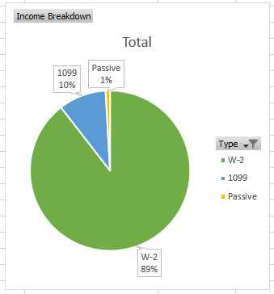

Title: "2018 Year in Review and 2019 Goals"
Published: 2018-12-21 00:01:00 -0500
Lead: 2018 was a huge year of accomplishments so I'll need to make 2019 count.
Tags:
- Life
- Goals
- Year in Review
- Accomplishments
---

[twitter]: https://twitter.com/kamranayub
[syntax-fm]: https://syntax.fm/show/067/hasty-treat-goal-setting
[2018-goals]: https://kamranicus.com/posts/2018-01-01-2018-a-new-year
[dotnet-rocks]: https://kamranicus.com/posts/2018-05-01-dotnetrocks-ravendb-podcast
[script-and-style]: https://www.youtube.com/watch?v=bqP2O3VHjQ8
[todd]: https://twitter.com/toddhgardner
[erik]: https://twitter.com/erikonarheim
[excalibur]: https://github.com/excaliburjs/Excalibur
[ktomg]: https://keeptrackofmygames.com
[office]: https://twitter.com/kamranayub/status/999037691382632449
[home-renovision]: https://www.youtube.com/channel/UCnorhjQR4zJkT7AVNhu395Q
[ps-guide]: https://kamranicus.com/posts/2018-12-20-typescript-react-components-pluralsight-guide
[travel-rewards]: https://www.choosefi.com/009-travel-rewards-travel-world-free-ultimate-guide/
[choosefi]: https://www.choosefi.com/
[baby-pi]: https://kamranicus.com/guides/raspberry-pi-3-baby-monitor
[vinyl-plank]: https://www.youtube.com/watch?v=OJqk2iS_jyQ

Wow, what a year! [At the start of 2018 I laid out my goals][2018-goals] and I ended up crushing them! I hadn't heard of [*SMART* goal setting yet][syntax-fm] but they ended up fitting the acronym: **S**pecific, **M**easurable, **A**chievable, **R**ealistic, and **T**ime-bound.

## Goals in Review

Let's review my 2018 and goals and see how I stacked up.

## Primary Goals

- ✅ ~~Publish 1 more Pluralsight course~~ ([DONE](https://kamranicus.com/posts/2018-10-18-new-azure-pluralsight-courses))
- ✅ ~~Host a half-day workshop (scheduled for April)~~ ([DONE](https://kamranicus.com/posts/2018-04-29-azure-nodejs-workshop-minnewebcon))
- ✅ ~~Participate in a LD game jam~~ ([DONE](https://kamranicus.com/posts/2018-04-29-ludum-dare-41-post-mortem))
- ✅ ~~Attend and present at 2 conferences~~ ([DONE](https://kamranicus.com/posts/2018-04-29-azure-nodejs-workshop-minnewebcon) and [DONE](https://kamranicus.com/posts/2018-05-11-ndc-minnesota-typescript-react))
- ✅ ~~Attend and present at a local user group~~ ([DONE](https://twitter.com/kamranayub/status/1037840790414864384))
- ✅ ~~Finish KTOMG UI revamp with React~~ ([DONE](https://twitter.com/kamranayub/status/1055344465991344128))
- ⛔ Continue doing code livestreams
- ⛔ Publish another Pi guide for a project I have in mind

## Stretch Goals

- ⛔ Become a Microsoft MVP
  - **Nominated, but nope.** Unfortunately, somehow my MVP nomination fell through the cracks and I didn't hear back until September this year. They advised me to re-submit. 😞
- ☑️ Publish 2 more Pluralsight courses
  - [Yes! Almost.](https://kamranicus.com/posts/2018-10-18-new-azure-pluralsight-courses) I ended up doing two courses at once this year.
- ⛔ Host a full-day workshop
  - **Nope.** Work's been busy with a new release so while I want to start this soon, it won't be in 2018.
- ⛔ Stream 10 sessions
  - **Nope.** Ended up not having the time/energy to do this.

## Retro

I'm definitely proud of what I accomplished in 2018--especially the dual-wielding courses. That was a risky proposition but with proper tracking and progress checkpoints, I managed to do it in almost as many hours as it took for me to do my first course.

It's clear my stretch goals were definite stretches! For my evenings, I have a few choices of what to do: laze about, contract work, [Keep Track of My Games][ktomg], open source, house work. You may be surprised to know a lot of the time I do end up lazing about--but it's with my wife or friends, watching shows, playing board games, or generally enjoying people's company. So I don't think it's *necessarily* unproductive! Still, those choices don't leave a ton of room for Twitch streaming. I'm just not positive it'll be a value-add activity for me, so I'm leaving it off my 2019 goals.

The MVP goal was very disappointing. Eventually after 10 months, the program manager responded to my email and said to just try again as the window was lost. It's supposed to be a 90-day window but for some reason I just got lost in the process. **It will** be on my 2019 goals again. New for 2019 is the requirement that you be nominated--luckily I have some MVP colleagues that are willing to put in a word for me! [Get in touch][twitter] if you want to throw your weight in, too.

Workshop? Just didn't have a chance. The half-day workshop was awesome and I'd do it again. In 2019 I may work on a React/TypeScript workshop and pitch it to Frontend Masters or to conferences. It may turn into a 2020 goal.

## Other Year-End Accomplishments

It's always the case you end up doing things you never planned. Here's what else I ended up accomplishing:

- **Hustle and passive income accounted for over 10% of my yearly earnings.**
  - This was a goal I had in mind but didn't write down for 2018. I wanted to try and see if I could make my gig/passive income account for at least 10% of my earnings and **it did!**

    

- **[Published first Pluralsight guide][ps-guide]**
  - My first guide around TypeScript/React came out this last week!
- **[Appeared on .NET Rocks to talk about RavenDB 4][dotnet-rocks]** 
  - How awesome is that?! Have been a fan for years and it was surreal to be on there.
- **[Appeared on Script & Style webcast to talk about Excalibur.js and web games][script-and-style]**
  - [Todd Gardner][todd] invited me on with my friend [Erik][erik] to discuss building web games and our open source experience with [Excalibur.js][excalibur]
- **Bought a house**
  - Found a good house for a good deal in a great neighborhood next to a school. The first project was done in May, which was to [build an office wall][office]! I'm super enthusiastic about learning to DIY and I can't recommend the [Home RenoVision][home-renovision] YT channel enough as a learning resource.
- **Had another kid**
  - Baby girl in November, she's awesome!
- **Released React rewrite of [KTOMG][ktomg]**
  - This was huge! At least a 8-10 month endeavor. I still have plenty of work to do with KTOMG but at least that's out of the way.
- **Finished some games:** Far Cry 5, Destiny 2 (story), Telltale's Game of Thrones.
  - Still working through Red Dead 2, AC: Syndicate, LoZ: BoW, and Witcher 3. They're all long, gimme some slack!
- **Published 13 blog posts**. Whoo!
- **Traveled to New England and Montreal with family**
  - Using [travel rewards][travel-rewards], the flights were free and hotels were split with a family friend. We rented a car and drove from Boston around New England up to Montreal and back. It was awesome.
- **Went through our finances with a fine-toothed comb**
  - This probably deserves its own post but I had a wake-up call of sorts and determined to eliminate a bunch of needless expenses we had been accumulating over the years. My wife and I are already fairly frugal people but didn't have a framework or the tools around it we needed. [Now we do][choosefi] and I'm super excited about it. I hope to do a post on it sometime in 2019. This aligns with me and my wife's 5- and 10-year plans for our family so I'm glad we started now.

## I'm Coming for You, 2019

With the SMART framework in mind, let's see if I can establish some goals to accomplish in 2019. Keeping in check that I have a new baby daughter, I'll need to focus on the **Attainable** and **Realistic** portions of the acronym.

### Primary Goals

**Professional**

- Publish 1 Pluralsight course on Azure or TypeScript or React by September
- Publish 4 Pluralsight guides on React & TypeScript by May
- Speak at NDC MN on a TypeScript topic
- Publish 5 technical articles on the blog about Azure, TypeScript, or React

**Personal**

- Pay off all non-mortgage debt
- Passive income should account for 2% of earnings, 1099 income for 5%
- Replace my PCs at home with single good Ultrabook/Notebook and a NAS
- Push 3 substantive updates to KTOMG throughout the year: Steam review revamp, Raven 4 upgrade, and Linux hosting

**DIY**

- Learn how to cut trim/baseboard and finish the nursery
- Finish my office decor/storage, maybe paint it too

### Stretch Goals

**Professional**

- Set up a quarterly newsletter
- Publish 1 more Pluralsight course on Azure or TypeScript or React
- Publish 4 additional Pluralsight guides throughout the year
- Participate in 1 Pluralsight Mentoring session
- Become a Microsoft MVP with a focus on Azure/TypeScript content
- Speak at a JSConf or ReactConf event
- Speak at the React MN meetup about TypeScript or GraphQL
- Record a YouTube video walkthrough of my [Raspberry Pi baby monitor][baby-pi] written guide

**Personal**

- 1099 income should account for 12% or more (+2% over 2018)
- Travel completely free somewhere in the US with wife and 2 kids using miles/points
- Participate in Ludum Dare during the spring

**DIY**

- Install [luxury vinyl plank][vinyl-plank] in my office
- Replace baseboard/trim in my son's bedroom

There you have it! These *seem* pretty doable to me as I am well-positioned to accomplish most of them this next year. For 2019 I split the goals into sub-groups to organize them better. Focusing on professional growth, personal goals, and DIY skills!

It's **still a lot** but what's life without a little ambition? I can top 2018 if I work at it. As for the baby, I accomplished everything last year without compromising time with my family. I am confident I can do the same in 2019 if I focus on it!