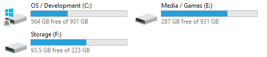

Title: "Migrating from disk drives to solid state drives"
Published: False
Lead: "This past week or so I finally sat down and migrated my PC from old spinning disk drives to solid state. In this post I'll share my process."
Tags:
- Hardware
---

If you measure the age of tech in dog years, my PC is old. 👴 It's a Frankenstein's monster, with some parts being relatively new like my Radeon R9 390 and other parts originally from my initial 2012 build. My hard drives were one of those OG parts. I had already upgraded my primary drive to be a 250GB SSD which helped but these days 250GB is not a lot (but [it ought to be](https://www.computerworld.com/article/2534312/the--640k--quote-won-t-go-away----but-did-gates-really-say-it-.html)). I also was running with 16GB of RAM and when recording courses or browsing a single fucking website in Chrome, my PC decided that it was too old for that shit and I was constantly in disk paging hell since my pagefile was too big for the SSD and was stored on a spinning disk.

This made me feel like grabbing my computer by its britches and lobbing it straight through my basement window so that any wayward frogs could hop joyfully on its carcass. Instead I spent some money. First, I installed 32GB of RAM. That helped. Then I was able to exorcise my 3 spinning disk drives and replaced them with 3 SSDs total, without re-imaging or re-installing anything. That can seem intimidating if you don't know the steps so I wanted to share how I successfully accomplished the feat.

## Picking out the drives

At my local [Micro Center](https://microcenter.com) I picked out two [Samsung 860 EVO SSDs 1TB](https://amzn.to/39EnZxD) drives that were each on clearance for about $200 total.

I figured 2TB + 250GB of SSD ought to be enough for my PC since I mainly do development now and some limited gaming. I need enough for about 5-8 AAA games and a dozen or so smaller games plus some storage for my media server. In the worst case I can stick the extra disks in a NAS.

One key thing to understand if you're looking at SSDs in 2020 and beyond is support for [NVMe](https://www.pcworld.com/article/2899351/everything-you-need-to-know-about-nvme.html). It's the latest storage tech for SSDs that provides the fastest possible speed. Unfortunately, being my rig is an old dog, I cannot teach it new tricks. Until next time, Fido. 🐶

## Going from multiple spinning disks

This is what I had:

- Old Disk 0: 250GB SSD (Primary OS)
- Old Disk 1: 1TB HDD (Development Work)
- Old Disk 2: 750GB HDD (Games/Media)
- Old Disk 3: 750GB HDD (Games/Media)

These disks had varied amounts of free space but in total I think I had about 700GB free between all of them. The primary drive was 95% or so full, enough that I couldn't get back more space.

I wanted to move to this:

- New Disk 0: 1TB SSD (OS / Development)
- New Disk 1: 1TB SSD (Storage / Games)
- New Disk 3: 250GB SSD (Storage / Games)

I don't think I _really_ need the extra 250GB but 🤷‍♂️.

## Playing Musical ~~Chairs~~ Files

Do you notice something about the desired end state above? It's actually **500GB less space** than what I had before. I'm becoming a minimalist in my old age.

What this meant in practice was that I needed to move files around in order to properly clone the HDDs over to the new SSDs and then *even after that*, I had to move files manually over from the HDDs.

The general idea was to move files over drive-by-drive to empty some less-used drives so I could disconnect them, then use some software to clone the migrated files from the old HDDs over to the new SSDs.

Step-by-step here's what I did at a high level:

1. Identify the drive with the most storage space (e.g. **Old Disk 1** in my case)
2. Copy over all "loose" files from other drives over to **Old Disk 1**, things like music, code, videos, etc. In my case, this left **Old Disk 2** empty as there was nothing really installed there.
3. Format **Old Disk 2** in Windows 10 completely so we can disconnect it (see [3 ways to format a disk in Windows 10](https://www.easeus.com/partition-master/format-hard-drive-in-windows-10.html))
4. Open up the PC, disconnect HDD **Old Disk 2**, connect SSD **New Disk 1**.
5. Boot up with [Clonezilla Live USB](https://clonezilla.org/clonezilla-live.php) drive plugged in
6. Clone device-to-device **Old Disk 1** to **New Disk 1** (see [how to clone small disk to larger disk](https://clonezilla.org/show-live-doc-content.php?topic=clonezilla-live/doc/03_Disk_to_disk_clone))
7. **Old Disk 1** can now be formatted or disconnected!

Repeat the same steps for the remaining drives, leaving the OS drive to the last. I wanted to be sure my cloning process is working. After booting up in Windows 10, I'd verify the new drive worked and then shutdown to disconnect the old drive.

## Moving program or game installation folders

Copying loose files is easy -- music, TV, videos, movies, backups, etc. But moving _installations_ of programs is a bit more work what with Windows Registry settings, etc. I had to reconfigure:

- [One Drive](https://support.office.com/en-us/article/change-the-location-of-your-onedrive-folder-f386fb81-1461-40a7-be2c-712676b2c4ae)
- [Steam Library](https://www.howtogeek.com/257472/how-to-painlessly-move-your-steam-library-to-another-folder-or-hard-drive/)
- [Windows Games](https://www.windowscentral.com/how-install-apps-separate-drive-windows-10) (installed via Xbox Game Pass)
- [Epic Games](https://www.howtogeek.com/404999/how-to-move-fortnite-to-another-folder-drive-or-pc/)

I followed the linked guides above to do it all, it took _forever_ to wait and wait for all the copying to finish but it did work.

> Note: I ran into an issue trying to move some games like Master Chief Collection. I got an error 0x80073d0b and [tried to follow some threads](https://answers.microsoft.com/en-us/windows/forum/apps_windows_10-winapps/windows-10-getting-error-0x80073d0b-when-moving/f42ecd3c-f386-4967-8df7-4887bd2f45e4?page=1&auth=1) on the problem but ended up simply uninstalling the games to re-download later. What luxury. 🤵

If you have other programs like Adobe Creative Cloud and such, be sure to move the installation location (carefully).

## Extending the partitions to non-adjacent unallocated space

When you use [Clonezilla](https://clonezilla.org/clonezilla-live.php) device-to-device cloning, it clones the full MBR and partition records. This means, my 250GB SSD had 2 partitions (the main one, 249.5GB and a 500MB recovery partition) and when it was cloned to a **1 TB drive** there was 700GB (ish) of unallocated space.

These partitions are shown in Disk Management in Windows 10. Normally, you can [extend a partition into the next unallocated space](https://www.partitionwizard.com/resizepartition/how-to-merge-unallocated-spaces.html). However, because the first partition of 249.5GB *was not adjacent to the unallocated 700GB block* I had to use a special free tool called [MiniTool Partition Wizard](https://www.partitionwizard.com/resizepartition/how-to-merge-unallocated-spaces.html) to "extend" the first partition to use the unallocated space because Disk Management in Windows 10 doesn't allow you to do that.

That was 10 minutes I didn't expect to spend but luckily Partition Wizard came to the rescue. 🤗

## Cleaning up the last hard drive

I had **Old Disk 2** last to clean up; so I had to move more files around because **New Disk 0** had a lot more free space (750GB worth). I copied stuff from **New Disk 1** and **Old Disk 2** so I could finally format and erase **Old Disk 2**.

Once I finished wiping the last HDD, I disconnected it and reconnected **Old Disk 0** which I then wiped in Windows and created [a new logical volume](https://www.partitionwizard.com/help/create-partition.html). Again, I had to use Partition Wizard because Windows 10 *would not delete the recovery partition* (for good reason because it didn't realize I one-upped it and migrated to a new better, faster, stronger drive).

## The final state

After all was said and done, I reached the desired final state! Whew. It took about 4 days since I had to wait for a lot of copying to finish but it was worth it, my PC is _screaming_ fast now.