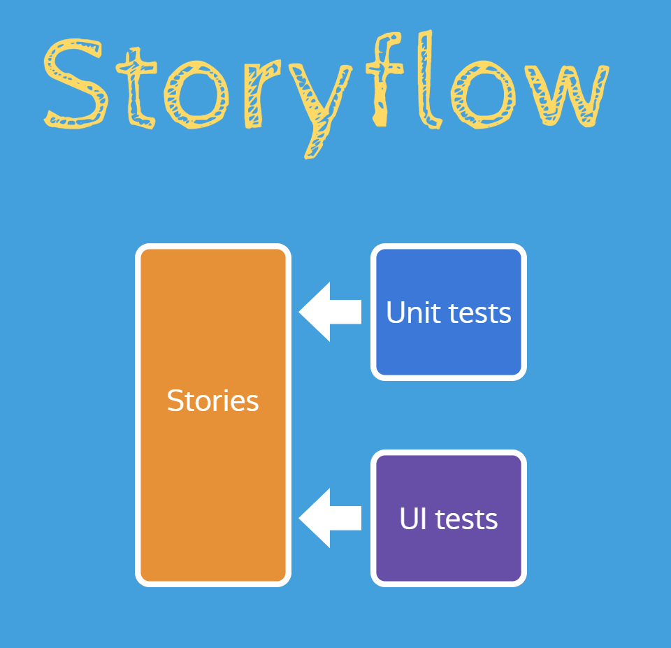

Title: "Storyflow: Using Storybook to Build a Better... Game Engine?"
Published: 2020-05-26 08:30:00 -0500
Lead: "I gave a talk recently on a novel workflow for Storybook, called Storyflow"
Tags:

- Talks
- JavaScript
- Storybook

---

Do you use [Storybook](https://storybook.js.org)? Do you use it to test game engines? Didn't think so! But we do for [Excalibur.js](https://excaliburjs.com) and I presented how and why we did it. The genesis for the talk came from a workflow I've been using recently that you can implement in your own projects which I call "Storyflow."

### Watch the Talk

I gave this talk at MN Dev Con on May 4 and again at React Minneapolis on May 21:

<iframe width="560" height="315" src="https://www.youtube.com/embed/biSFvQmMJsc" frameborder="0" allow="accelerometer; autoplay; encrypted-media; gyroscope; picture-in-picture" allowfullscreen></iframe>

### What is Storyflow?

The Storybook workflow (ahem, _Storyflow_) we follow puts Storybook stories at the center of our workflow. The concept is simple in practice: write your unit and functional tests _against Storybook_ instead of importing directly from component files like other workflows.

The "normal" component-based workflow goes like:

1. Write my component in `MyComponent.js`
2. Write my unit test, `MyComponent.test.js` and import `MyComponent`
3. Write a functional test, against my running app, which may test one aspect of `MyComponent` in use or maybe a few different behaviors/states

But with [Storybook](https://storybook.js.org) the workflow instead flips the script and centers your testing on isolated components through stories:

1. Write my component in `MyComponent.js`
2. Write my Storybook story `DefaultState` in `MyComponent.stories.js` and import `MyComponent`
3. Write my unit test, `MyComponent.test.js` **and import `DefaultState` from stories**
4. Write a functional test against `DefaultState` story in Storybook

It's comes down to a _slight_ shift in thinking. Without Storybook, normally you'd be putting your component into different states _within_ your unit tests. _With_ Storybook, you're already showcasing your component in different states, which makes your unit tests a lot trimmer. Finally, you can add UI testing on top of it to ensure your component works in the browser (without having to manually verify in Storybook).

There are 3 major benefits we've seen from this:

1. One source of truth for all our tests (stories)
2. Incentivizes writing more stories
3. Promotes more testability

### One source of truth

Since your unit and functional tests are run against stories, Storybook becomes the source of truth for any tests. Contrast that to developing without stories, where each test could render components in different states and the only way to know would be to examine each test. Having a published Storybook as a static site makes things a lot more discoverable.

### Incentivizes writing more stories

Since tests are written _against_ stories, in order to write more tests... you'll need to write more stories. Having more stories means better documentation (even if it's just code!).

### Promotes more testability

In order to write a solid Storybook story, it has to run in isolation. That means that you will likely lift up more heavy concerns like data fetching, state management, and other stuff higher and have more atomic reusable components. We actually still write stories against our "container" components but it requires a lot more mocking using [Storybook decorators](https://storybook.js.org/docs/basics/writing-stories/#decorators).

## Example

If you're curious to see this in action, I have a [GitHub repository](https://github.com/kamranayub/example-storyflow) set up you can clone and run and I showcase this workflow within the video above.

You can view a working demo on CodeSandbox using the repository!

<iframe
     src="https://codesandbox.io/embed/github/kamranayub/example-storyflow/tree/master/?fontsize=14&hidenavigation=1&module=%2Fsrc%2FLoginForm.stories.js&theme=dark"
     style="width:100%; height:500px; border:0; border-radius: 4px; overflow:hidden;"
     title="storybook-testing-example"
     allow="accelerometer; ambient-light-sensor; camera; encrypted-media; geolocation; gyroscope; hid; microphone; midi; payment; usb; vr; xr-spatial-tracking"
     sandbox="allow-forms allow-modals allow-popups allow-presentation allow-same-origin allow-scripts allow-autoplay"
   ></iframe>

Let me know in the comments if you've used this workflow and how it's been working for you!